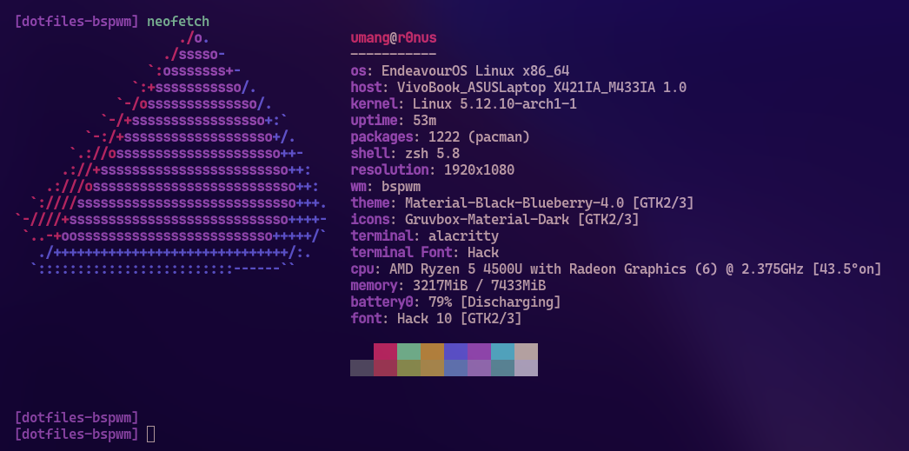

<p align="center">

</p> 
<h2 align="center"> ━━━━━━  ❖  ━━━━━━ </h2>

<div align="center">
    <code>bin</code> for scripts,
    <code>cfg</code> for configs,
    <code>etc</code> for other stuff
</div>

<p/>


<h2 align="center"> ━━━━━━  ❖  ━━━━━━ </h2>

<!--
    Got lazy using tags lol.
 -->

### ❖ Installation

   First, clone the repo.
   ```bash
    $ git clone --depth=1 https://github.com/umgbhalla/dotfiles-bspwm.git
   ```

   Then, update the submodules.
   ```bash
    $ cd dotfiles-bspwm
   ```

   Finally, run the setup script.
   ```bash
    $ ./setup.sh
   ```

<hr>

### ❖ Keybinds


  |          Keybind          |         Description         |
  | ------------------------- | --------------------------- |
|super + Return                  |   # terminal alacritty |
|super + shift + Return          |   # terminal kitty |
|super + e                       |   # Shortcuts |
|super + w                       |   # firefox |
|super + n                       |   # thunar |
|super + d                       |   # dmenu_run |
|super + a                       |   # neovide |
|super + b                       |   # bpytop |
|super + r                       |   # ranger |
|super + space                   |   # program launcher |
|alt + Return                    |   # mini google |
|alt + e                         |   # rofimoji |
|alt + semicolon                 |   # scratchpad |
|alt + m                         |   # man search |
|alt + r                         |   # random manpage |
|alt + v                         |   # clipmenu |
|alt + h                         |   # keybindhelper |
|alt + p                         |   # config rofi menu ; open in nvim |
|super + period                  |   # show open window |
|super + shift + d               |   # show ssh sesssions |
|super + p                       |   # power-menu  |
|super + Escape                  |   # make sxhkd reload its configuration files: |
|super + {t,shift + t,s,f}       |   # set the window state |
|super + alt + {q,r}             |   # quit/restart bspwm |
|super + {_,shift + }q           |   # close and kill |
|super + m                       |   # alternate between the tiled and monocle layout |
|super + y                       |   # send the newest marked node to the newest preselected node |
|super + g                       |   # swap the current node and the biggest window |
|super + ctrl + {m,x,y,z}        |   # set the node flags |
|super + {_,shift + }{h,j,k,l}   |   # focus the node in the given direction |
|super + {_,shift + }c           |   # focus the next/previous window in the current desktop |
|super + bracket{left,right}     |   # focus the next/previous desktop in the current monitor |
|super + {grave,Tab}             |   # focus the last node/desktop |
|super + {o,i}                   |   # focus the older or newer node in the focus history |
|super + {_,shift + }{1-8,0}     |   # focus or send to the given desktop |
|super + ctrl + {h,j,k,l}        |   # preselect the direction |
|super + ctrl + {1-9}            |   # preselect the ratio |
|super + ctrl + space            |   # cancel the preselection for the focused node |
|super + ctrl + shift + space    |   # cancel the preselection for the focused desktop |
|super + alt + {h,j,k,l}         |   # expand a window by moving one of its side outward |
|super + alt + shift + {h,j,k,l} |   # contract a window by moving one of its side inward |
|super + {Left,Down,Up,Right}    |   # move a floating window |
|super+Print                     |   # Screenshots but better |


<hr>
this how u generate a table for sxhkdrc , i dont know how to add | in middle 😵
<br>  
  

   ```bash
 awk '/^[a-z]/ && last {print "|" $0,"\t",last,"|"} {last=""} /^#/{last=$0}' ~/.config/sxhkd/sxhkdrc |  column -t -s $'\t'
   ```

### ❖ Dependencies

   This are all optional but you can install if you want to replicate my desktop or something.

   * bspwm, sxhkd and bsp-layout
   * rofi
   * rofimoji
   * polybar
   * neovim-nightly
   * alacritty
   * dunst
   * picom-ibhagwan-git
   * light
   * clipmenud
   * maim, jq, xclip and viewnior

<hr>

### ❖ Notes

   * Install NeoVim plugins
   * i dont remember where i got this gtk theme

<hr>

### ❖ System Info


   

<br/>

<hr>

configs and scripts shared from https://github.com/TheRealKizu and https://github.com/siduck76

<hr>

fork of https://github.com/TheRealKizu/dotfiles and https://github.com/umgbhalla/dotfiles_meowV2 [i dont remember why i named it so....] 

<hr>
